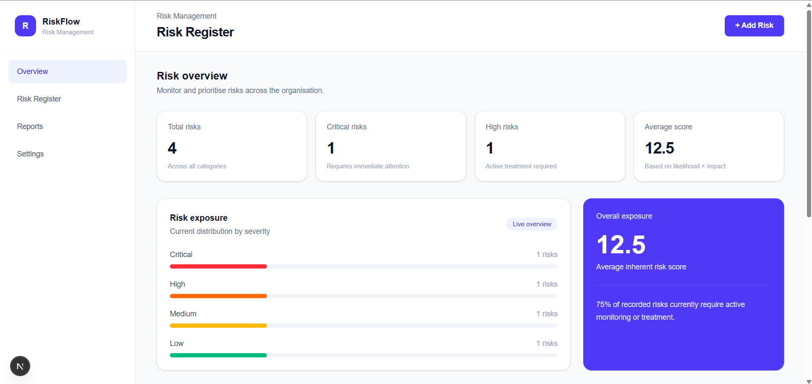

# Secure Risk Register

A full-stack risk management application for identifying, assessing, tracking, and managing organisational risks.

Built with **Next.js, TypeScript, PostgreSQL, Prisma, and Tailwind CSS**.

## Live Demo

[View the live application](https://secure-risk-register-qjnx.vercel.app/)

## Dashboard

## Overview

Secure Risk Register provides a central dashboard for managing organisational risks. Users can create, edit, search, filter, and delete risks while the application automatically calculates risk scores and assigns severity ratings based on likelihood and impact.

The project demonstrates full-stack application development, API design, database persistence, data modelling, and production-style UI patterns.

## Features

- Create, view, edit, and delete risks
- PostgreSQL-backed persistent storage
- Automatic risk scoring based on likelihood × impact
- Critical, High, Medium, and Low risk classification
- Dynamic dashboard metrics
- Risk exposure overview
- Search risks by title, ID, category, owner, or status
- Filter by risk rating and status
- Loading, empty, and error states
- Responsive SaaS-style dashboard

## Engineering Highlights

- Designed a PostgreSQL data model for persistent risk management
- Built API routes for complete CRUD operations
- Implemented server-side risk score and severity calculation
- Connected the Next.js frontend to persistent database storage
- Added dynamic dashboard metrics derived from live risk data
- Implemented search and multi-criteria filtering
- Added loading, empty, and error states for resilient data fetching
- Structured the application with typed TypeScript models and reusable components

## Tech Stack

- **Frontend:** Next.js 16, React, TypeScript
- **Styling:** Tailwind CSS
- **Backend:** Next.js API Routes
- **Database:** PostgreSQL
- **Database Layer:** Prisma
- **Deployment:** Vercel (coming soon)

## Architecture

Frontend Dashboard  
↓  
Next.js API Routes  
↓  
Prisma  
↓  
PostgreSQL

## Risk Scoring

Risk scores are calculated automatically:

`Risk Score = Likelihood × Impact`

The application then assigns a rating:

| Score | Rating |
|------:|--------|
| 17–25 | Critical |
| 10–16 | High |
| 5–9 | Medium |
| 1–4 | Low |

## Project Status

Core risk management functionality is complete, including persistent CRUD operations, automatic scoring, dashboard metrics, search, filtering, and application states.

Additional UI polish and deployment are in progress.